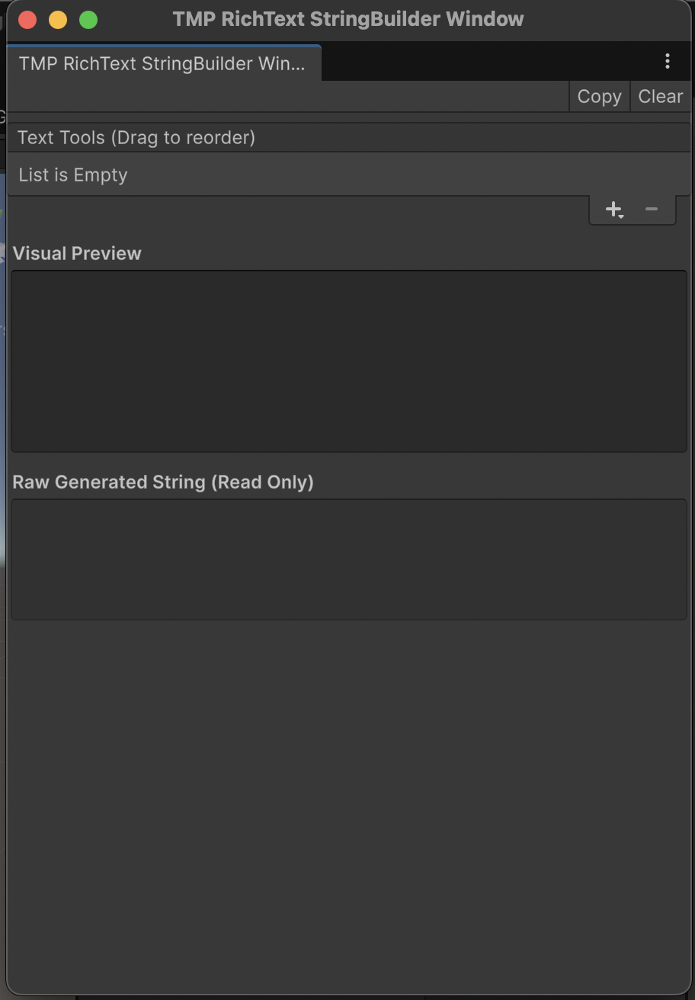
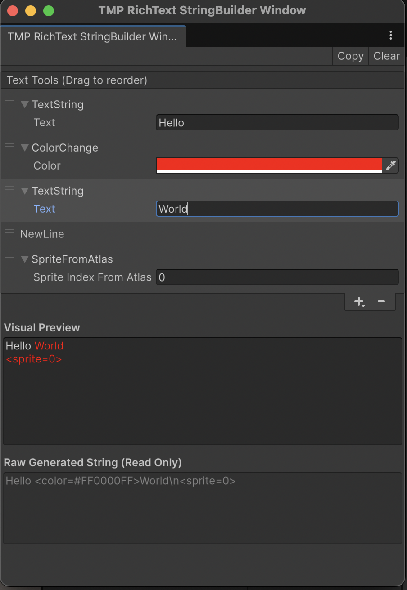

# TMP-RichText-StringBuilder

Editor tool for building **TextMeshPro** rich text strings with colors, sprites, and formatting.  
Designed to simplify the process of creating complex TMP strings visually.

---

## Features
- Visual editor window inside Unity Editor
- Color tags (`<color=...>`)
- Sprite tags (`<sprite=...>`)
- Line breaks
- Copy-ready TMP rich text output
- Reorderable elements with drag & drop

---

## Installation (Unity Package Manager)

Add via Git URL:
https://github.com/polaryana/TMP-RichText-StringBuilder.git

---

## Opening the TMP RichText StringBuilder Window

To open the editor window, go to the Unity top menu:
Tools → TMP RichText StringBuilder Window

Or use the search bar (`Ctrl+K / Cmd+K`) and type **TMP RichText StringBuilder**.  

The window will open like this:

  
*Visual editor for building rich text strings.*

---

## Adding and Managing Elements

In the editor window, you can add different types of elements to build your string.  

Click the **Add** button (+) to see the dropdown menu with available element types:

- **Text String** – Adds plain text.
- **New Line** – Inserts a line break (`\n`).
- **Color Change** – Changes text color using Unity color picker.
- **Sprite From Atlas** – Adds a sprite from the assigned TMP sprite atlas.

Elements can be **reordered** by dragging them up or down in the list.

Example workflow:

1. Add a **Text String**: type `"Hello "`.
2. Add a **Color Change**: pick red color.
3. Add another **Text String**: type `"World"`.
4. Add a **New Line** for a line break.
5. Add a **Sprite From Atlas** to insert an icon.

  
*Drag to reorder, use the Add dropdown to add new elements.*

---

## Copying the Generated TMP String

After adding elements and arranging them, the bottom section shows two previews:

1. **Visual Preview** – displays rich text with colors, (!) but not sprites.
2. **Raw Generated String** – the actual TMP-compatible string.

Click the **Copy** button in the toolbar to copy the generated string to your clipboard.  

Example output:
Hello <color=#FF0000>World</color>\n<sprite=0>

This string can be pasted directly into a **TextMeshPro** component in your scene.

---

## Usage Notes

- Elements that are `null` or removed will be skipped in the final string.
- Color and sprite elements apply immediately in the visual preview.
- The window automatically rebuilds the string as you add, remove, or reorder elements.